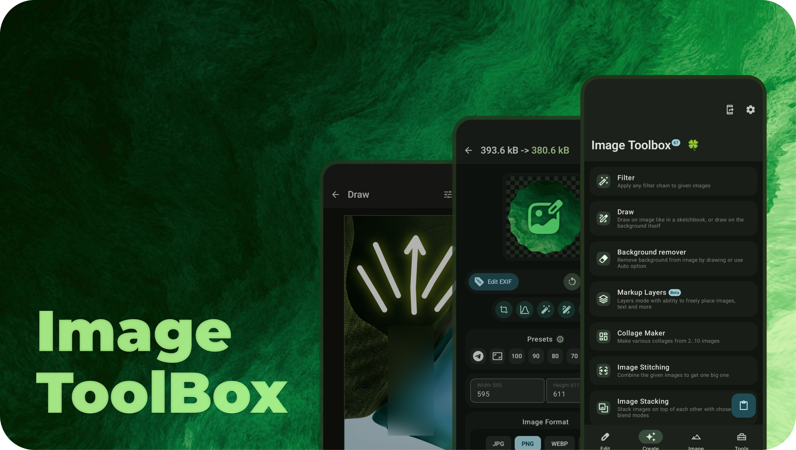

<div align="center">
</br>


</div>

<div align="center">

# Vidya-Eureka

</div>

</br>

<p align="center">
  </a>
  </a>
  </a> 
    </a>
</p>

<div align="center">

# 🗺️ Project Overview

Vidya-Eureka is an innovative educational platform designed to revolutionize learning experiences. It combines interactive tools with comprehensive resources to create an engaging environment for students and educators alike.

</div>

<p align="middle">
    
</p>

<div align="center">

# 📔 Wiki

Check out Vidya-Eureka [Wiki](https://github.com/AyushWaghmare019/Vidya-Eureka/wiki) for FAQ and useful info

# ☕ Support the Project

If you find this project valuable, consider supporting its development

# 📲 Download

Go to the [Releases](https://github.com/AyushWaghmare019/Vidya-Eureka/releases/latest) to download the latest version.

</div>

# ✨ Features

* Interactive learning tools
* Comprehensive educational resources
* Personalized learning paths
* Progress tracking
* Collaborative features

# 💻 Installation Instructions

1. Clone the repository:
   ```bash
   git clone https://github.com/AyushWaghmare019/Vidya-Eureka.git
